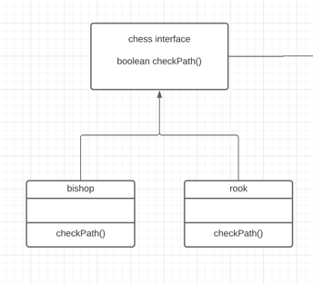
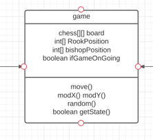
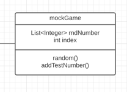

#Chess Game
Solution:

Designed an interface to all kinds of chess to implement. The method checkPath() will check if this
chess will step on others' moving path.

pros:

when adding other types of chess, they can also implement the interface to reduce duplication.
 Used polymorphism. Follows OOD design pattern. Instead of using instanceOf and switch cases.

cons:

if we are adding more methods accordingly for each type of chess, we need to
add these methods each time separately in every class.
 Using switch cases will allow us to write the methods once.

Designed a game class to include the chess board which is the 2D array of chess,
since the board has x axis and y axis. Used a simple 1D array to represent the current position of the chess.
ifGameOnGoing is the state of the game object, this allows us to print the result of the game.
In this case, Move method is only used by the rook. Used mod to handle the cases when the chess
go beyond the boundary of the chess board.

pros:

Used mod to deal with the boundary location, makes the process less complex.

cons:

the move method is only for the rook now, because we assumed the bishop never move.
When we add more traits for the bishop or add other moving chesses into the game,
it required us to redesign the move().

Designed a mock Game class for testing purpose

pros:

Can now specify seed to mock random number
